# Compact Inkjet (3 Station Auto Inkjet)

โปรแกรมคุมสายพิมพ์ Inkjet ของงาน Compact ใช้พิมพ์บนเหล็ก (Plate) และชิม (Shim) ของผ้าเบรก
พนักงานยิงบาร์โค้ดใบงานที่คอมพิวเตอร์จุดสแกน งานจะไปเข้าคิวที่ Station 1 แล้วโปรแกรมส่งข้อมูลเข้าเครื่อง MK, เครื่อง UV และ PLC ให้เอง
ไม่ต้องเดินไปพิมพ์ข้อมูลที่หน้าเครื่องทีละตัว

ทุกเครื่องใช้โปรแกรมตัวเดียวกัน ต่างกันแค่ค่า `MENU_LEVEL` ในไฟล์ตั้งค่า ว่าเครื่องนั้นเป็น Scan Barcode, Station 1 หรือ Station 3

---

## ทำอะไรได้บ้าง

- ยิงบาร์โค้ดลงทะเบียนงาน ข้อมูลงานดึงมาจาก PrintData.db3 เอง
- ส่งโปรแกรมและข้อความเข้า MK-058 / MK-059 และ UV1 / UV2 ตาม Marking Method ของงาน
- ทุกครั้งที่เริ่มงาน MK จะส่ง PostAct, Delay ของแต่ละหัว และ Conveyor Speed เข้า PLC ให้ด้วย
- สั่งระยะแคลมป์ของงาน UV ผ่าน PLC แคลมป์ (6 แกน)
- ใช้ปุ่มกดหน้างานแทนการกดเริ่มงานบนจอได้
- หน้า Order List บอกได้ว่าเครื่องไหนกำลังพิมพ์งานอะไร และมีงานรอคิวอยู่ไหม

## งานเดินยังไง

1. ที่ Scan Barcode ยิงบาร์โค้ดแล้วกด OK งานจะไปเข้า Backend ที่คอมพิวเตอร์ Station 1
2. Station 1 เห็นงานในหน้า Order List กด **เริ่มงาน** แล้วโปรแกรมส่งข้อมูลเข้าเครื่องตาม Marking Method
3. งานที่ผ่าน UV2 (Marking 10 / 11 / 12) จะไปขึ้นที่ Station 3 ด้วย และไปจบที่ Station 3
   Station 3 กดเริ่มงานได้ แต่คนส่งข้อมูลเข้า UV2 จริง ๆ คือคอมพิวเตอร์ Station 1 เครื่องนั้นจึงต้องเปิดไว้ตลอด
4. พิมพ์เสร็จกด **จบงาน** งานจะย้ายไปอยู่ในแท็บ History

---

## หน้าจอ

### 1. Scan Barcode

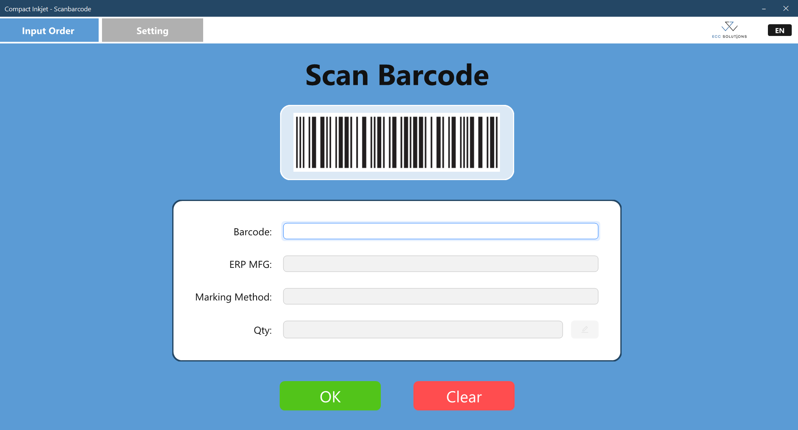

เปิดโปรแกรมที่คอมพิวเตอร์จุดสแกนบาร์โค้ด จะเข้าหน้า Input Order เลย
ยิงบาร์โค้ดที่ช่อง Barcode ได้ทันที (หรือพิมพ์แล้วกด Enter) ไม่ต้องคลิกที่ช่องก่อน
ERP MFG, Marking Method กับ Qty จะขึ้นมาเอง ดูให้ตรงกับงานแล้วกด OK ช่องทั้งหมดจะว่าง พร้อมยิงใบต่อไป
ถ้า Qty ว่างหรือไม่ถูกให้กดปุ่มดินสอแก้ก่อน ส่วนปุ่ม Clear ไว้ล้างข้อมูลแล้วเริ่มใหม่

ตอนติดตั้งต้องตั้งค่าในหน้า Setting ครั้งเดียว 2 อย่าง

- **Database Setting** เลือกไฟล์ `PrintData.db3` (ข้อมูลงานพิมพ์) กับ `mydatabase.db3` (ระยะแคลมป์ของงาน UV) ต้องขึ้น ✓ พร้อมใช้งาน ทั้งสองช่องก่อนกด Save
- **Backend DB Setting** ใส่ IP Address ของคอมพิวเตอร์ Station 1 กด Check Status รอไฟเขียวแล้วค่อยกด Save

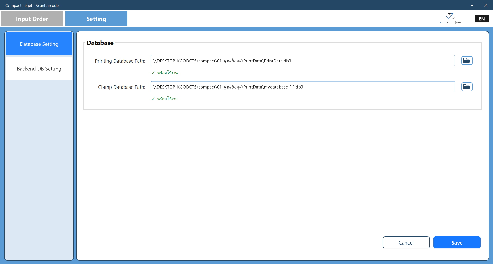

### 2. Station 1 · Order List

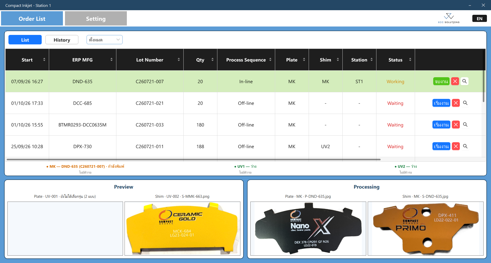

หน้าหลักของ Station 1 ดูรายการงานกับสถานะเครื่องได้ในหน้าเดียว

- แท็บ List คืองานที่ยังไม่จบ History คืองานที่จบหรือยกเลิกไปแล้ว มีตัวกรองทั้งหมด / In-line / Off-line
- Status ตัวแดงคือ Waiting ยังไม่เริ่ม ตัวส้มคือ Working กำลังทำ ช่อง Station บอกว่างานอยู่สถานีไหนตอนนี้
- ปุ่มท้ายแถวมี เริ่มงาน / จบงาน, X ไว้ยกเลิกงาน และแว่นขยายไว้เปิด Order Detail
- แถบใต้ตารางเป็นสถานะเครื่อง MK / UV1 / UV2 ว่ากำลังพิมพ์งานไหน และมีงานรอคิวไหม
- Preview เป็นรูปตัวอย่าง Plate / Shim ของงานที่เลือกในตาราง ส่วน Processing เป็นรูปของงานที่กำลังพิมพ์อยู่

### 3. Station 1 · Order Detail

กดแว่นขยายที่แถวงาน จะเห็นข้อมูลทั้งหมดที่จะส่งเข้าเครื่อง

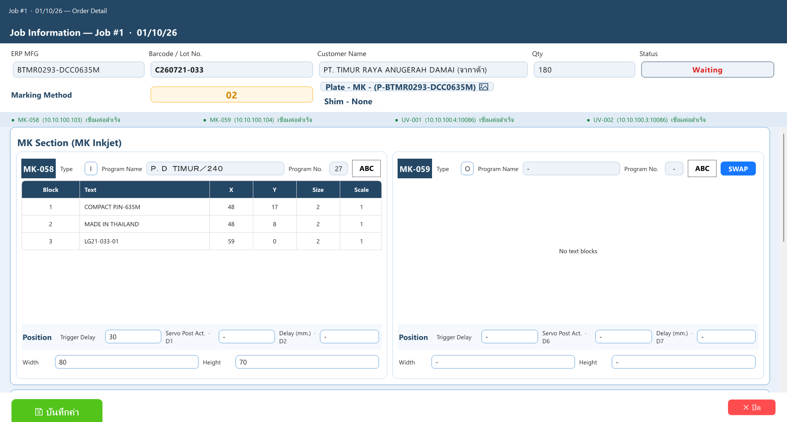

ด้านบนเป็นข้อมูลงาน (ERP MFG, Lot No., ลูกค้า, Qty) กับ Status ซึ่งบอกขั้นที่งานอยู่ เช่น Working (Mark Plate)
Marking Method บอกว่าเครื่องไหนทำด้าน Plate เครื่องไหนทำด้าน Shim กดรูปภาพข้าง ๆ เพื่อดูรูปตัวอย่างได้
แถบใต้ข้อมูลงานเป็นสถานะการเชื่อมต่อของ MK-058, MK-059, UV-001 และ UV-002

MK Section มีโปรแกรม ข้อความที่จะพิมพ์ และตำแหน่ง (Position) ของ MK แต่ละหัว
ถ้าข้อมูลของสองหัวใส่สลับกันมา กด SWAP ทีเดียวจบ แก้อะไรแล้วอย่าลืมกด **บันทึกค่า** ส่วน **ปิด** คือกลับหน้า Order List

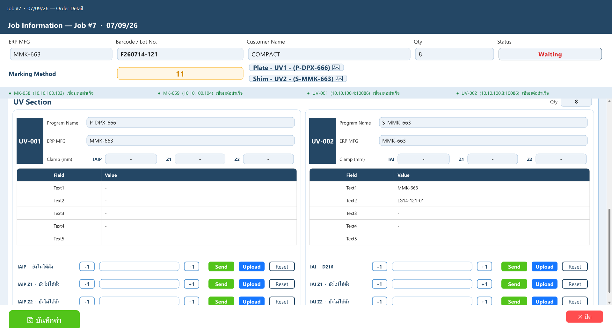

เลื่อนลงมาเป็น UV Section รูปนี้เป็นงาน Marking 11 คือ UV1 พิมพ์บนเหล็ก และ UV2 พิมพ์บนชิม
แต่ละเครื่องมี Program Name กับข้อความ Text1–Text5 ที่จะส่งเข้า UV
ระยะแคลมป์ปรับได้ด้วย -1 / +1 กด Send ให้ PLC ขยับตาม กด Upload ถ้าจะเก็บค่าลงฐานข้อมูลไว้ใช้รอบหน้า และ Reset ไว้ล้างคำสั่ง

### 4. Station 1 · Printer Setting

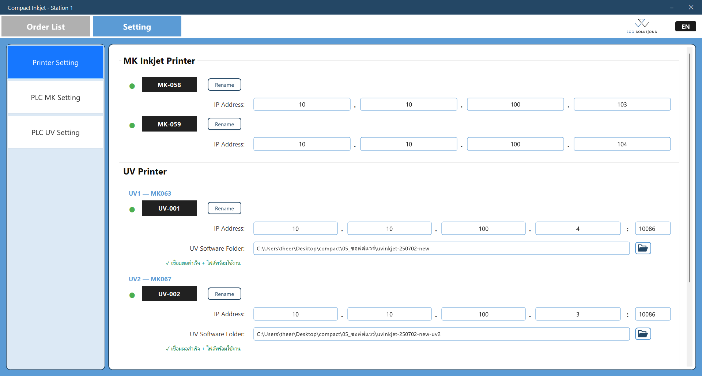

เปิด Setting > Printer Setting ตั้ง IP Address ของ MK-058 / MK-059 และ IP : Port ของ UV1 / UV2
เครื่อง UV ต้องเลือก UV Software Folder (โฟลเดอร์โปรแกรม UV ของเครื่องนั้น) ด้วย
ขึ้น ✓ เชื่อมต่อสำเร็จ กับ ไฟล์พร้อมใช้งาน ครบคือใช้ได้ ถ้าขึ้น ⚠ ข้อความสีแดง ให้ดูสายแลน ดูว่าเปิดเครื่องอยู่ไหม แล้วเช็ค IP อีกที

เลื่อนลงไปจะมี Marking Reference Image เป็นโฟลเดอร์รูปตัวอย่างที่เอาไปแสดงใน Preview
ปุ่ม Check Status ตรวจทุกเครื่องพร้อมกัน แก้เสร็จกด Save ถ้าไม่เอาก็กด Cancel

### 5. Station 1 · PLC MK Setting

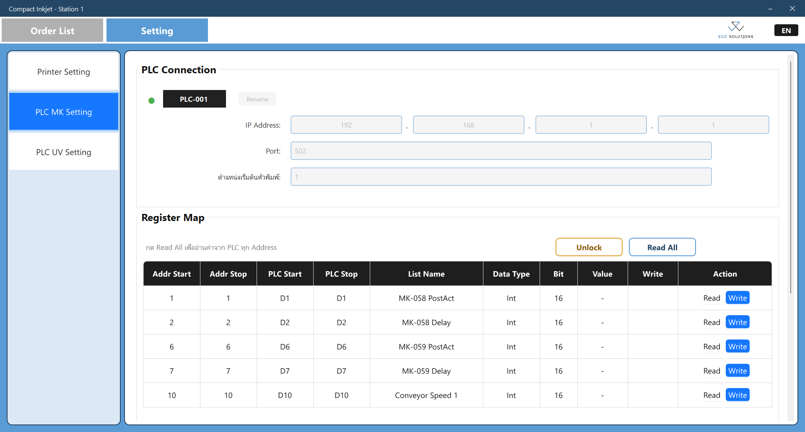

PLC ตัวนี้คุมตำแหน่งหัวพิมพ์กับสายพาน คุยกันด้วย Modbus TCP
ตำแหน่งเริ่มต้นหัวพิมพ์คือค่าที่ส่งให้หัวพิมพ์กลับไปรอเวลาไม่มีงาน

Register Map คือค่าที่ส่งให้ PLC ทุกครั้งที่เริ่มงาน MK (PostAct / Delay ของแต่ละหัว และ Conveyor Speed)
ต้องกด Unlock ก่อนถึงจะแก้ได้ Read All ไว้อ่านค่าปัจจุบันจาก PLC มาดูทุก Address หรือจะ Read / Write ทีละตัวก็ได้
ปุ่ม Save กับ Cancel อยู่ด้านล่าง กดได้หลังจาก Unlock และแก้ค่าแล้ว

### 6. Station 1 · PLC UV Setting และปุ่มกดหน้างาน

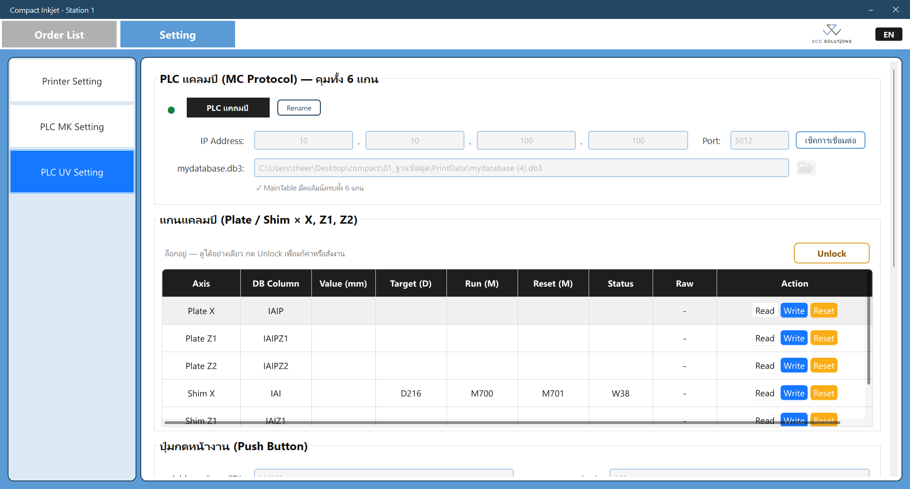

PLC แคลมป์ของงาน UV มี 6 แกน ใส่ IP Address กับ Port แล้วกด เช็คการเชื่อมต่อ
ไฟล์ `mydatabase.db3` ต้องขึ้น ✓ MainTable มีคอลัมน์ครบทั้ง 6 แกน
กด Unlock ก่อน แล้วค่อย Read / Write / Reset ทีละแกน

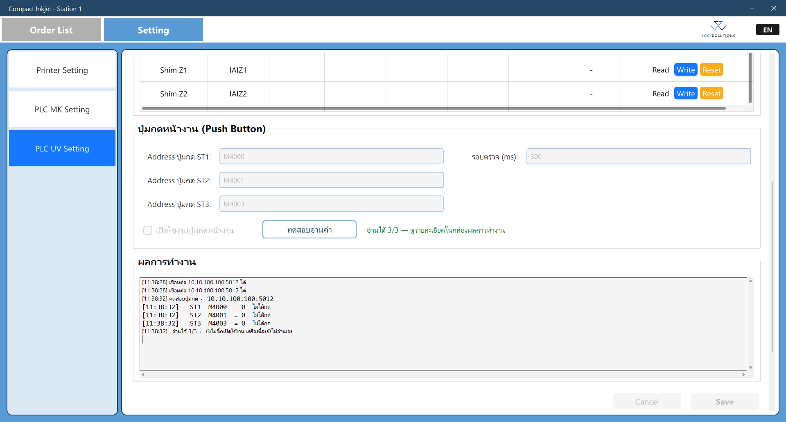

เลื่อนลงมาเป็น ปุ่มกดหน้างาน (Push Button) ของ ST1 / ST2 / ST3
ใส่ Address ของแต่ละปุ่ม รอบตรวจ (ms) คือความถี่ที่โปรแกรมอ่านปุ่ม ปกติใช้ 300
กด Unlock แล้วติ๊กเปิดใช้งาน กด **ทดสอบอ่านค่า** ต้องขึ้น อ่านได้ 3/3 ก่อนกด Save

### 7. Station 3

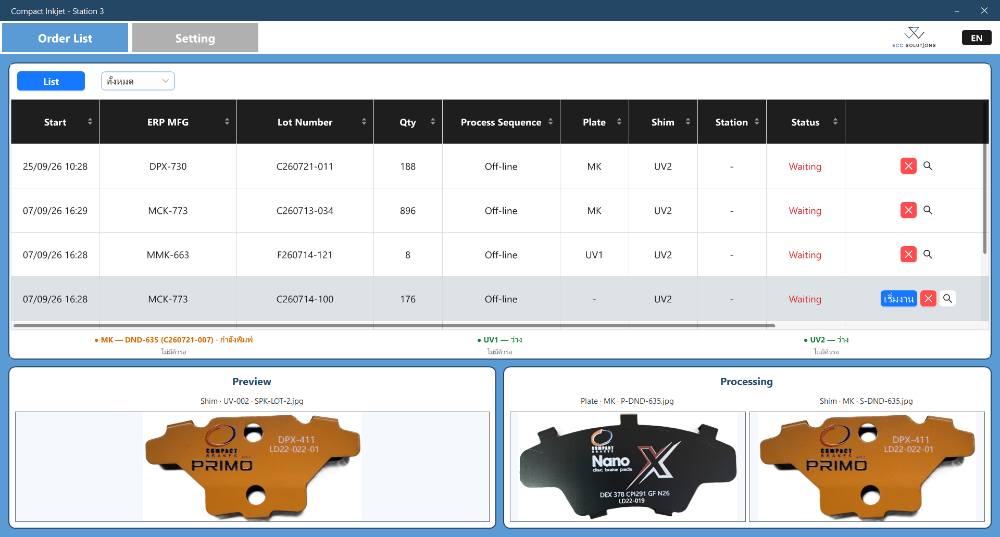

Station 3 เห็นเฉพาะงานที่ผ่าน UV2 (Marking 10 / 11 / 12) มีแท็บ List อย่างเดียว ไม่มี History
งาน Marking 10 กดเริ่มงานที่ Station 3 ได้เลย ส่วนงาน 11 / 12 ต้องเริ่มที่ Station 1 ก่อน ระหว่างนั้นจะเห็นแค่ X กับแว่นขยาย พอ ST1 เริ่มแล้วถึงจะมีปุ่มจบงาน

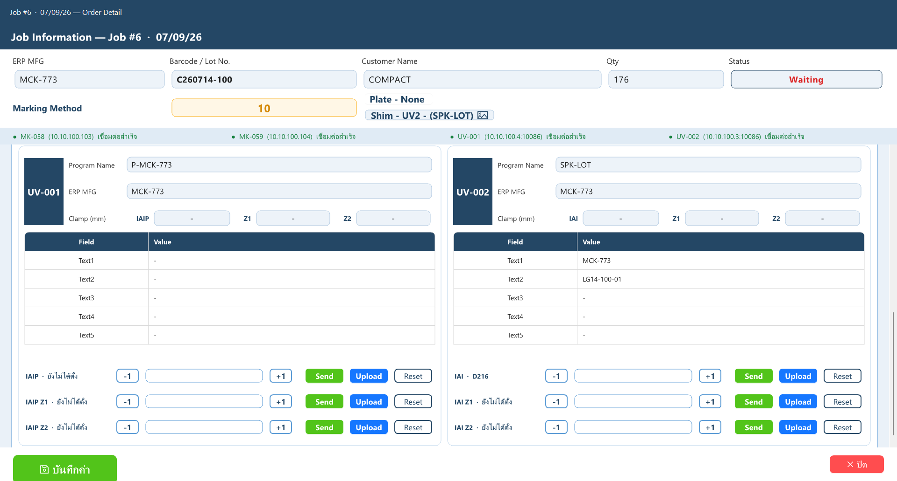

Order Detail ของ Station 3 รูปนี้เป็นงาน Marking 10 คือไม่พิมพ์ Plate พิมพ์เฉพาะ Shim ที่ UV2
มี Program Name, ข้อความ Text1–Text5 และระยะแคลมป์ฝั่ง Shim (IAI / Z1 / Z2)

ตอนติดตั้ง Station 3 ต้องตั้ง Backend DB Setting ให้ชี้ไปที่คอมพิวเตอร์ Station 1 เหมือนกับเครื่อง Scan Barcode

---

## สถานะและสี

ใช้เหมือนกันทุกสถานี

| ที่เห็น | หมายถึง |
| :--- | :--- |
| Waiting | งานยังไม่เริ่ม (ตัวหนังสือแดง) |
| Working | กำลังทำ (ตัวหนังสือส้ม แถวระบายเขียว) ใน Order Detail จะบอกขั้นด้วย เช่น Working (Mark Plate), Waiting (Q2) คือรอคิวที่ 2 |
| Finished | จบงานแล้ว (ตัวหนังสือเขียว อยู่ใน History) |
| Incomplete | จบงานแล้ว แต่ส่งเข้าเครื่องไม่ครบทุกเครื่อง (ตัวหนังสือส้ม) |
| Cancelled | ยกเลิกแล้ว (ตัวหนังสือเทา) กด พิมพ์ใหม่ ใน History ถ้าจะเอากลับมา |
| ไฟสถานะเครื่อง | เขียว = เชื่อมต่อได้, แดง = เชื่อมต่อไม่ได้, เทา = ยังไม่ได้ตรวจหรือยังไม่ได้ตั้งค่า |
| ปุ่มจบงาน | เขียว = ส่งครบแล้ว, ส้ม = ยังส่งไม่ครบ (กดได้ แต่จะมีเตือนก่อน) |

---

## ตั้งค่าแต่ละเครื่อง

ค่าทั้งหมดอยู่ที่ `C:\ProgramData\CompactInkjet\Setting.config` โปรแกรมสร้างไฟล์ให้เองตอนเปิดครั้งแรก
IP กับ path ต่าง ๆ แก้ในหน้า Setting ของโปรแกรม ส่วน `MENU_LEVEL` แก้ในไฟล์

| `MENU_LEVEL` | เครื่อง | เห็นเมนู |
| :---: | :--- | :--- |
| 0 | Scan Barcode | Input Order, Setting |
| 1 | Station 1 | Order List, Setting |
| 3 | Station 3 | Order List (เฉพาะงานที่ผ่าน UV2), Setting |
| 9 | ทดสอบหน้างาน | Setting อย่างเดียว |
| 99 | สำหรับพัฒนา | ทุกหน้า |

ค่าตั้งต้นของ Station 1 (เครื่องที่ตั้งเป็น Station 1 จะได้ค่าพวกนี้เองตอนเปิดครั้งแรก)

| เครื่อง | IP Address | Port |
| :--- | :--- | :--- |
| MK-058 / MK-059 | 10.10.100.103 / 10.10.100.104 | |
| UV1 / UV2 | 10.10.100.4 / 10.10.100.3 | 10086 |
| PLC MK | 192.168.1.1 | 502 |
| PLC แคลมป์ | 10.10.100.100 | 5012 |
| ปุ่มกดหน้างาน ST1 / ST2 / ST3 | M4000 / M4001 / M4003 | |

รายละเอียดเรื่องไฟล์ตั้งค่าอยู่ใน [docs/settings-file-locations.md](docs/settings-file-locations.md)

---

## Tech Stack

| ส่วน | ใช้อะไร |
| :--- | :--- |
| โปรแกรมหน้างาน | C# WinForms, .NET 8 |
| UI | AntdUI 2.4.3 |
| ฐานข้อมูลงานพิมพ์ / แคลมป์ | SQLite (`PrintData.db3`, `mydatabase.db3`) |
| Backend | Node.js, Express, Sequelize |
| ฐานข้อมูลคิวงาน | PostgreSQL |
| ตัวติดตั้ง | Visual Studio Installer Project (MSI) |

## โครงสร้างโฟลเดอร์

```
InkjetOperator/   โปรแกรมหลัก
InkjetBackend/    Backend API
CompactDemo/      โปรเจคตัวติดตั้ง
tools/            สคริปต์สร้างตัวติดตั้ง และสคริปต์แคปหน้าจอ
tests/            โปรแกรมทดสอบ
docs/             เอกสารและรูปหน้าจอ
```

## Build และรัน

โปรแกรม: เปิด `CompactInkjet.sln` ด้วย Visual Studio 2022 แล้วกด Run หรือสั่ง

```bash
dotnet build CompactInkjet.sln
```

Backend: สร้างไฟล์ `InkjetBackend/.env` ใส่ `POSTGRESQL_HOST` เป็น connection string ของฐานข้อมูล (ถ้าไม่ใส่ `PORT` จะใช้ 3000) แล้วสั่ง

```bash
cd InkjetBackend
npm install
npm start
```

ตัวติดตั้ง: ปิด Visual Studio ก่อน แล้วดับเบิลคลิก `build-installer.bat`
สคริปต์จะเพิ่มเลขเวอร์ชันให้และวางไฟล์ MSI ไว้ในโฟลเดอร์ `dist\`
เครื่องที่จะ build ต้องมี Visual Studio 2022 ที่ลง extension "Microsoft Visual Studio Installer Projects 2022" กับ .NET 8 SDK
ตัวติดตั้งจะเช็คว่าเครื่องปลายทางมี .NET 8 Desktop Runtime หรือยัง และลงให้ทุกบัญชีผู้ใช้ในเครื่อง
